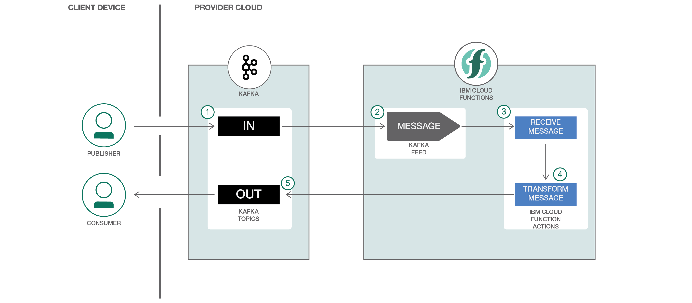

# Serverless reference architecture for IBM Event Streams data processing with IBM Cloud Functions

[](https://travis-ci.org/IBM/ibm-cloud-functions-refarch-data-processing-message-hub)

This project deploys a reference architecture with IBM Cloud Functions to execute code in response to messages or to handle streams of data records. No code runs until messages arrive via IBM Event Streams (powered by Apache Kafka). When that happens, function instances are started and automatically scale to match the load needed to handle the stream of messages.

You can learn more about the benefits of building a serverless architecture for this use case in the accompanying [IBM Code Pattern](https://developer.ibm.com/code/patterns/respond-messages-handle-streams/).

Deploy this reference architecture:

- Through the [IBM Cloud Functions user interface](#deploy-through-the-ibm-cloud-functions-console-user-interface).
- Or by using [command line tools on your own system](#deploy-using-the-wskdeploy-command-line-tool).

If you haven't already, sign up for an IBM Cloud account then go to the [Cloud Functions dashboard](https://console.bluemix.net/openwhisk/) to explore other [reference architecture templates](https://github.com/topics/ibm-cloud-functions-refarch) and download command line tools, if needed.

## Included components

- IBM Cloud Functions (powered by Apache OpenWhisk)
- IBM Event Streams (powered by Apache Kafka)

The application deploys two IBM Cloud Functions (based on Apache OpenWhisk) that read from and write messages to IBM Event Streams (based on Apache Kafka). This demonstrates how to work with data services and execute logic in response to message events.

One function, or action, is triggered by message streams of one or more data records. These records are piped to another action in a sequence (a way to link actions declaratively in a chain). The second action aggregates the message and posts a transformed summary message to another topic.



## Deploy through the IBM Cloud Functions console user interface

Choose "[Start Creating](https://console.bluemix.net/openwhisk/create)" and select "Deploy template" then "Event Streams Events" from the list. A wizard will then take you through configuration and connection to event sources step-by-step.

Behind the scenes, the UI uses the `wskdeploy` tool, which you can also use directly from the CLI by following the steps in the next section.

## Deploy using the `wskdeploy` command line tool

This approach will deploy the Cloud Functions actions, triggers, and rules using the runtime-specific manifest file available in this repository.

- Download the latest [`bx` CLI and Cloud Functions plugin](https://console.bluemix.net/openwhisk/learn/cli).
- Download the latest [`wskdeploy` CLI](https://github.com/apache/incubator-openwhisk-wskdeploy/releases).
- Provision an [IBM Event Streams](https://console.bluemix.net/catalog/services/event-streams) instance, and name it `kafka-broker`. You can use the web console to create your instance, or the CLI with a command like so:
```
$ bx resource service-instance-create kafka-broker messagehub enterprise-3nodes-2tb us-south
```
Once created, on the "Manage" tab of your Event Streams console create two topics: _in-topic_ and _out-topic_. On the "Service credentials" tab make sure to add a new credential named _Credentials-1_.
- Copy `template.local.env` to a new file named `local.env` and update the `KAFKA_INSTANCE`, `SRC_TOPIC`, and `DEST_TOPIC` values for your instance if they differ.

### Deploy with `wskdeploy`

```bash
# Clone a local copy of this repository
git clone https://github.com/IBM/ibm-cloud-functions-refarch-data-processing-message-hub.git
cd ibm-cloud-functions-refarch-data-processing-message-hub

# Make service credentials available to your environment
source local.env
bx wsk package refresh

# Deploy the packages, actions, triggers, and rules using your preferred language
cd runtimes/nodejs # Or runtimes/[php|python|swift]
wskdeploy
```

### Undeploy with `wskdeploy`

```bash
# Deploy the packages, actions, triggers, and rules
wskdeploy undeploy
```

## Alternative deployment methods

### Deploy manually with the `bx wsk` command line tool

[This approach shows you how to deploy individual the packages, actions, triggers, and rules with CLI commands](bx-wsk/README.md). It helps you understand and control the underlying deployment artifacts.

### Deploy with IBM Continuous Delivery

[This approach sets up a continuous delivery pipeline that redeploys on changes to a personal clone of this repository](bx-cd/README.md). It may be of interest to setting up an overall software delivery lifecycle around Cloud Functions that redeploys automatically when changes are pushed to a Git repository.

## License

[Apache 2.0](LICENSE)
